

  <h1>
  nn-experimental-toybooks
  </h1>

## 🔎 About this repo
This repository is a collection of my toy experiments for various deep learning topics. Each idea is within each one Jupyter notebook. All notebooks are based on Colab environment.

## 🧪 Experiment Lists

<!-- 
![GNN][tag-gnn] ![3D][tag-3d] ![Representation Learning][tag-replearn] ![Neural ODE][tag-node] ![Diffusion][tag-diffusion] 
-->

[tag-generative]: https://img.shields.io/badge/Generative-6366F1?style=flat-square
[tag-gnn]: https://img.shields.io/badge/GNN-3B82F6?style=flat-square
[tag-3d]: https://img.shields.io/badge/3D-8B5CF6?style=flat-square
[tag-replearn]: https://img.shields.io/badge/Representation_Learning-10B981?style=flat-square
[tag-node]: https://img.shields.io/badge/Neural_ODE-F59E0B?style=flat-square
[tag-diffusion]: https://img.shields.io/badge/Diffusion-14B8A6?style=flat-square

[tag-gnn-big]: https://img.shields.io/badge/GNN-3B82F6?style=for-the-badge
[tag-3d-big]: https://img.shields.io/badge/3D-8B5CF6?style=for-the-badge
[tag-replearn-big]: https://img.shields.io/badge/Representation_Learning-10B981?style=for-the-badge
[tag-node-big]: https://img.shields.io/badge/Neural_ODE-F59E0B?style=for-the-badge
[tag-diffusion-big]: https://img.shields.io/badge/Diffusion-14B8A6?style=for-the-badge
[tag-generative-big]: https://img.shields.io/badge/Generative-6366F1?style=for-the-badge

<!--
Spare tag color palette (hex)
- Sky Blue: 0EA5E9
- Indigo: 4F46E5
- Violet: 7C3AED
- Emerald: 059669
- Lime: 65A30D
- Amber: D97706
- Rose: E11D48
- Slate: 475569
Usage example:
  https://img.shields.io/badge/TagName-0EA5E9?style=flat-square
  https://img.shields.io/badge/TagName-0EA5E9?style=for-the-badge
-->

| Index | Experiment Topic | Key Concepts & Papers | Link |
| :---: | :--- | :--- | :---: |
| **01** | **[GCN & Oversmoothing](#01-gcn-and-oversmoothings)**  ![GNN][tag-gnn] | Graph Neural Networks, Oversmoothing, DeepGCNs | [🚀](./01-gcn-oversmoothings.ipynb) |
| **02** | **[Flow & Rectified Flow](#02-flow-model-and-rectified-flow)** ![Generative][tag-generative] ![Neural ODE][tag-node] | CNF, FFJORD, Rectified Flow, ODE | [🚀](./02-flow-and-rectification.ipynb) |
| **03** | **[Meta Optimization](#03-meta-optimization)** ![Representation Learning][tag-replearn] | Meta-Learning, MAML, Reptile, Few-shot | [🚀](./03-meta-optimization.ipynb) |
| **04** | **[Score Matching](#04-score-matching-sampling-and-guidance)** ![Generative][tag-generative] ![Diffusion][tag-diffusion] | NCSN, DDPM, DDIM, CFG | [🚀](./04-score-sampling-guidance.ipynb) |
| **05** | **[Point Cloud Autoencoder](#05-point-cloud-autoencoder)** ![3D][tag-3d] ![Generative][tag-generative] | Point Cloud, PointNet, VAE, PointGMM | [🚀](./05-point-cloud-autoencoder.ipynb) |

 

### 01. [GCN and Oversmoothings](./01-gcn-oversmoothings/README.md)
![GNN][tag-gnn-big]

In general, it is know that GCN cannot be stacked deeply since neighborhood aggregation works as a low-pass filter. On the other hand, Transformers can be stacked deeply although self-attention is equivalent to GCN on complete graph; thanks to normalizations and residual connections.

In this notebook `01-gcn-oversmoothings.ipynb`, I worked on CORA for inspecting oversmoothing, with testing normalization and residual connections, along with sharpening operations.

<h3>Reference works</h3>

**[DeepGCNs: Residual Connections for GNN](https://arxiv.org/abs/1904.03751)**

**[GREAD: Reaction-Diffusion based GNN](https://arxiv.org/abs/2211.14208)**

---

### 02. [Flow Model and Rectified Flow](./02-flow-and-rectification/README.md)
![Generative][tag-generative-big] ![Neural ODE][tag-node-big]

Although flow-based model's concept is very nice and intuitive, it's early phase's obstacle was calculation of Jacobians for calculating log likelihood. FFJORD solved network constraints by applying Hutchinson estimator for Jacobian Trace calculation. Further, it is also found that the intuitive approach that connects start point to end point works well, even leading reasonable one-step generation.

   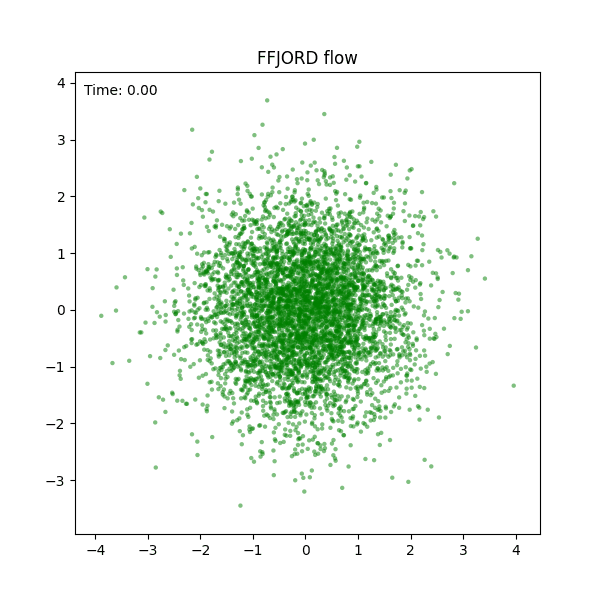
   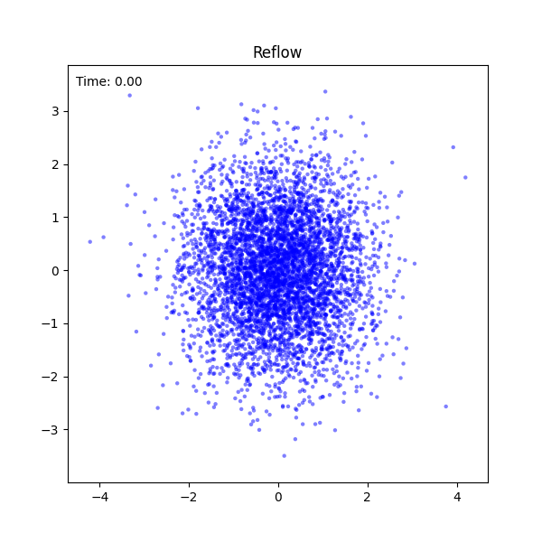
   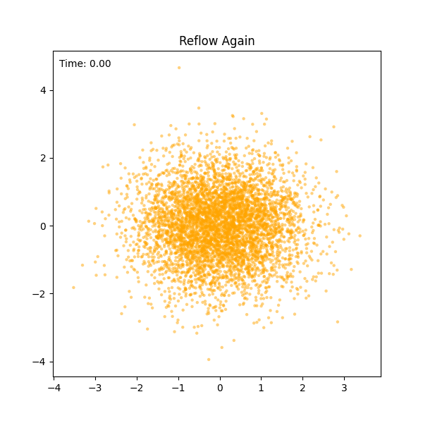

In this notebook `02-flow-and-rectification.ipynb`, first worked on gaussian-to-swiss-roll generation using FFJORD, and applied reflow algorithms for the flow model.

<h3>Reference works</h3>

**[FFJORD: Free Form CNF model](https://arxiv.org/abs/1810.01367)**

**[Rectified Flow: Flow Straight and Fast](https://arxiv.org/abs/2209.03003)**

---

### 03. [Meta Optimization](./03-meta-optimization.ipynb)
![Representation Learning][tag-replearn-big]

Meta-learning is a methodology for finding versatile initialization point that can quickly adapt to any few-shot task only with a few gradient steps. While MAML suggested fundamental and model-agnostic way as its name, it has crucial overhead of calculating second-order Hessian. So in Reptile, rather than using gradient descent for inner loop gradient steps, it updates the initialization simply towards the fine-tuned weights.

    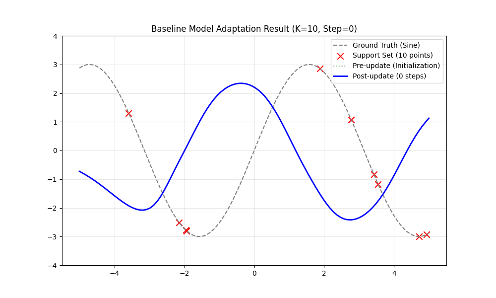
    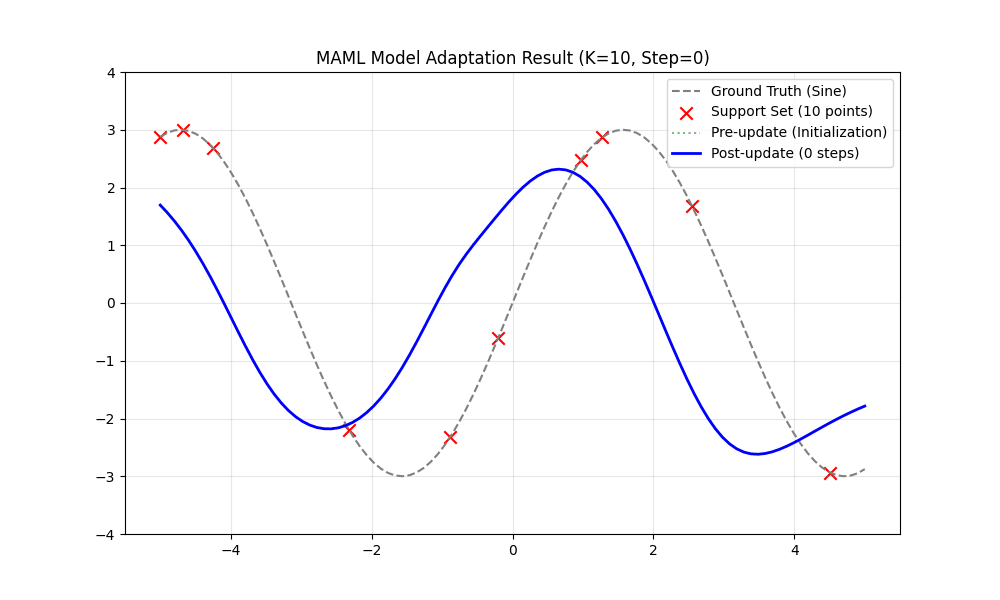
    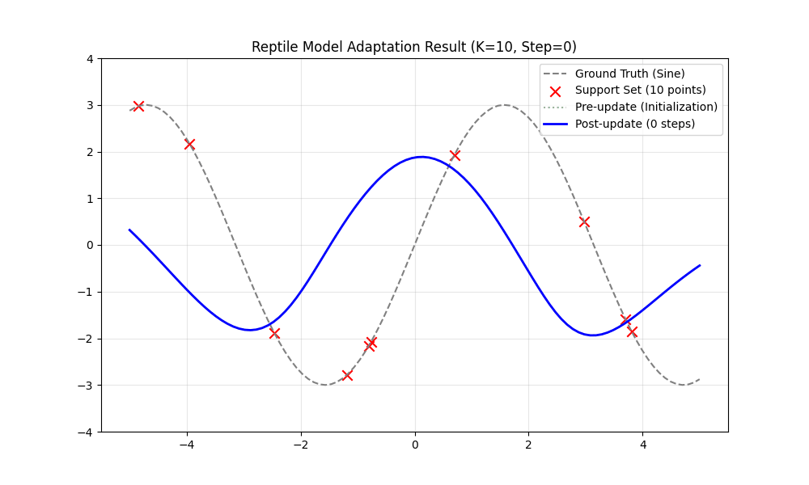

In this notebook `03-meta-optimization.ipynb`, I worked for simple sine regression tasks for baseline pre-trained MLP, MAML, and Reptile.

<h3>Reference works</h3>

**[MAML: Model-Agnostic Meta Learning](https://arxiv.org/abs/1703.03400)**

**[Reptile: First-Order Fast approximation of MAML](https://arxiv.org/abs/1803.02999)**

---

### 04. [Score Matching: Sampling and Guidance](./04-score-sampling-guidance.ipynb)
![Generative][tag-generative-big] ![Diffusion][tag-diffusion-big]

The concept of Stochastic Differential Equations can generalize generative models through diffusion process, such as NCSN, DDPM, and DDIM, with different diffusion terms and drift terms. Such unification brought very natural guidance techniques using the property of scores.  

    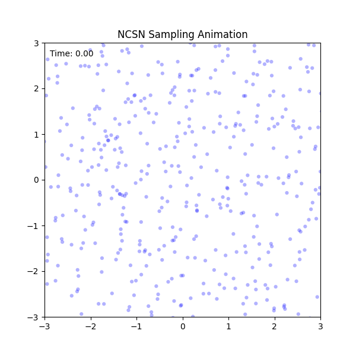
    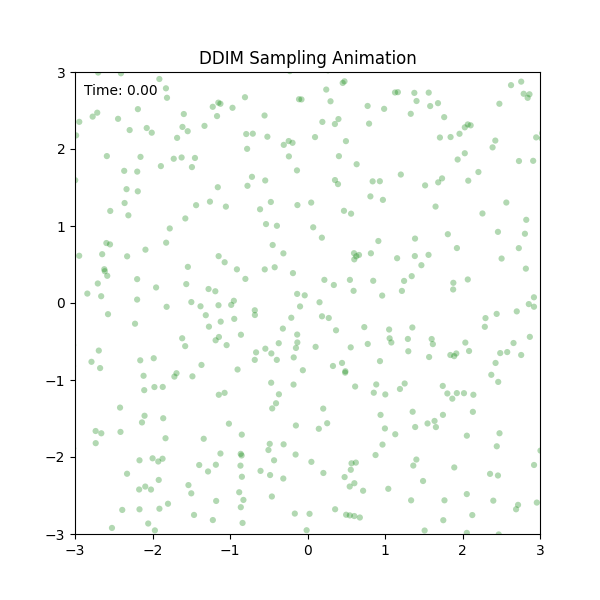
    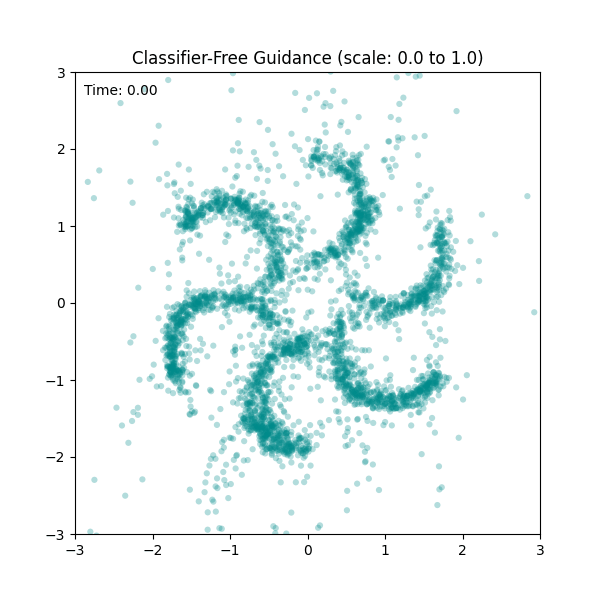

In this notebook `04-score-sampling-guidance.ipynb`, using simple score matching network, I tried with different trajectories but comparable sample quality. Plus, guidance techniques like classifier guidance and CFG are also tested on DDIM sampler.

<h3>Reference works</h3>

**[Score-based Generative Modeling through SDE](https://arxiv.org/abs/2011.13456)**

**[DDIM: Denoising Diffusion Implicit Models](https://arxiv.org/pdf/2010.02502)**

**[Classifier Guidance: Diffusion Beats GAN](https://arxiv.org/abs/2105.05233)**

**[Classifier-Free Guidance](https://arxiv.org/abs/2207.12598)**

---

### 05. [Point Cloud Autoencoder](./05-point-cloud-autoencoder.ipynb)
![3D][tag-3d-big] ![Generative][tag-generative-big]

Point cloud is a common output form of many 3D scanners. As PointNet suggested a high-quality point cloud encoder that can capture 3D global structures, it is natural to think of autoencoder on point cloud space, even variational ones too. One naive approach would be representing reconstruction term as just Chamfer Distance or other point cloud distance metrics; which is actually not strictly satisfies ELBO. The other one that uses GMM can capture exact reconstruction term and has a lot of usages like unsupervised segmentation, as it can explicitly predict the distributions of points.

    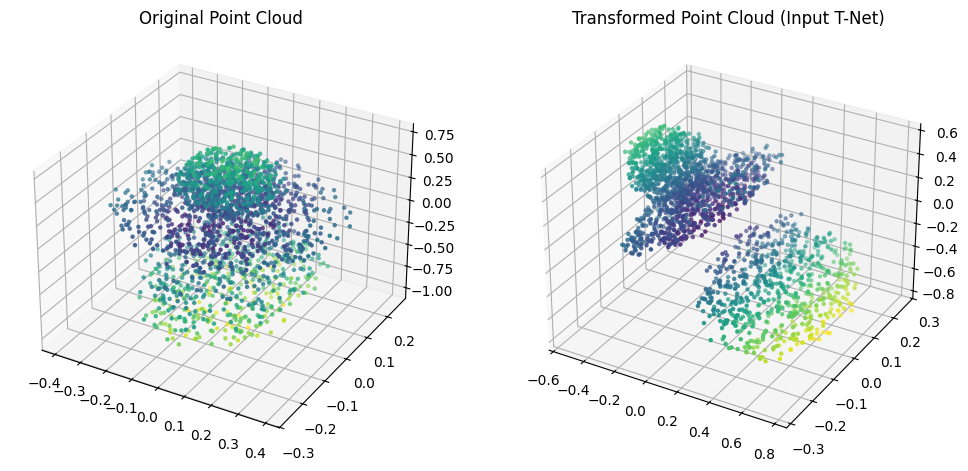
    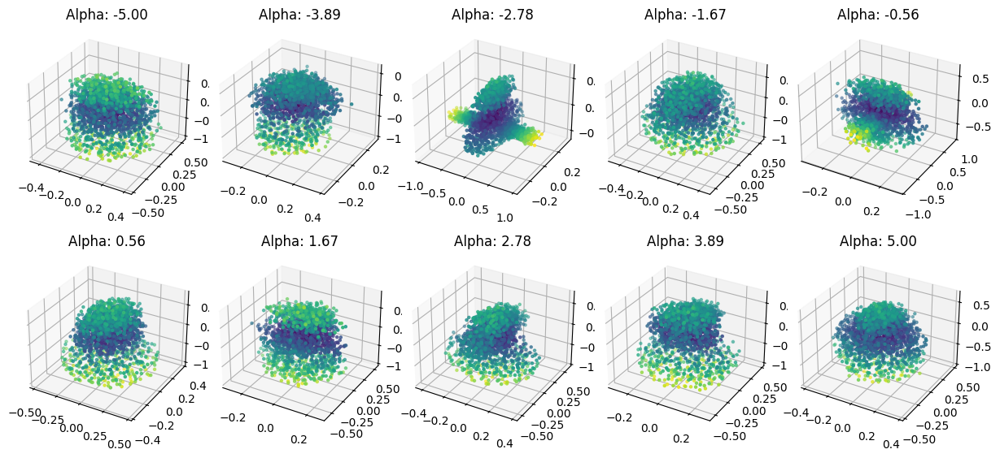
    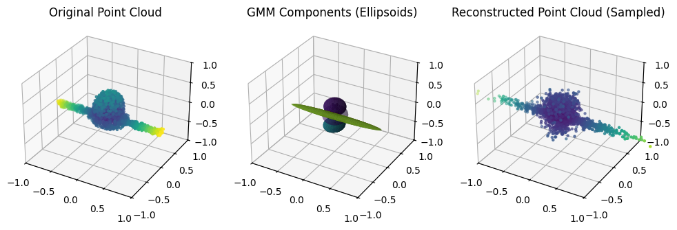

In this notebook `05-point-cloud-autoencoder.ipynb`, I tested with PointNet encoders, naive MLP decoders, and Hierachical Split decoders for autoencoding tasks. Plus, you can investigate how T-net works on PointNet encoder, how GMM component of PointGMM is shaped on 3D space, and how unsupervised clustering (point segmentation) works on 3D point cloud domain.

<h3>Reference works</h3>

**[PointNet](https://arxiv.org/abs/1612.00593)**

**[Point Cloud Generation](https://arxiv.org/abs/1707.02392)**

**[PointGMM: Point Cloud GMM Networks](https://arxiv.org/abs/2003.13326)**